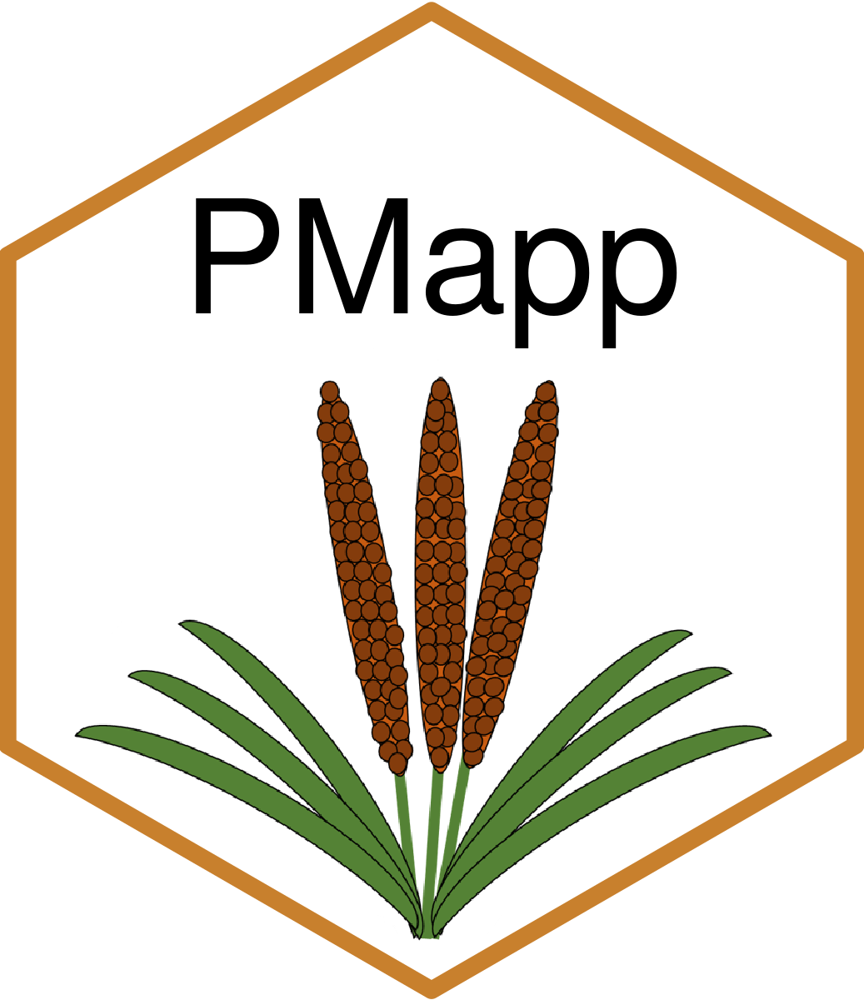

PMapp: Pearl millet agronomy and crop model prediction in India
====

<p align="center">
  
</p>

## Overview

This application provides interactive statistics and crop model predictions about pearl millet production in India.

## Installation

In R console:

```
devtools::install_github("vincentgarin/PMapp")

```

## Usage


```

library(PMapp)

run_app()

```
